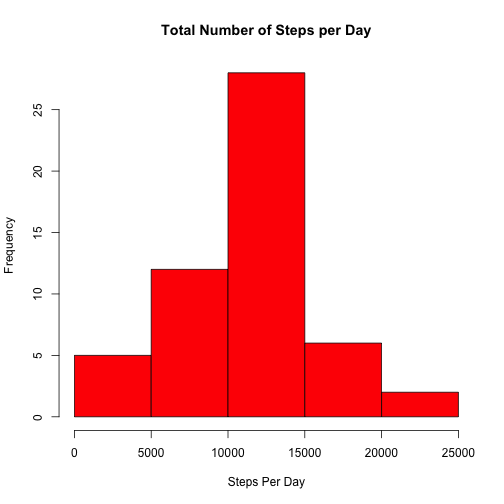
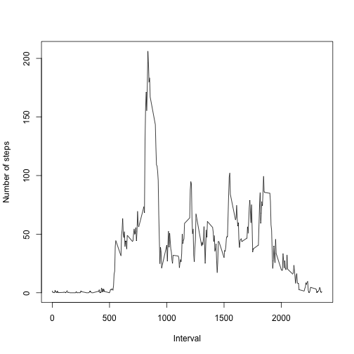
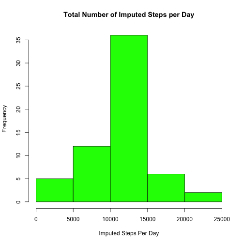
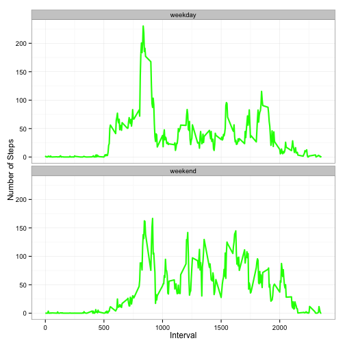

Reproducible Research - Peer Assessment 1
===========================================
### Introduction

This assignment is an analysis of data from a personal activity monitoring device that collects data at 5 minute intervals through out the day. The data consists of two months of data from an anonymous individual collected during the months of October and November, 2012 and include the number of steps taken in 5 minute intervals each day.

### Loading and preprocessing the data

First load the data into memory in preparation for the analysis.

```r
#Reading the data in CSV format
activity <- read.csv("~/datasciencecoursera/RepData_PeerAssessment1/activity.csv")
```

### Calculating the mean total number of steps taken per day

In this part of the analysis, the code below begins by calculating the total number of steps taken per day and then plotting the results on a histogram.

```r
#calculating total number of steps taken per day
Steps_Per_Day <- aggregate(steps ~ date, activity, sum, na.rm=TRUE)

#plotting a histogram of total number of steps taken per day
hist(Steps_Per_Day$steps, col = "red", 
     main = "Total Number of Steps per Day", xlab="Steps Per Day")
```

 

```r
#calculating mean and median steps taken per day
mediansteps <- median(Steps_Per_Day$steps)
meansteps <- mean(Steps_Per_Day$steps, digits =7)
```

The code calculates that the median and mean steps taken per day to be 10765 and 1.0766189 &times; 10<sup>4</sup>

### Average daily activity pattern

The code below aggregates the average steps taken per 5-interval, averaged across all days. This avtivity is then plotted on a linear time series.


```r
#aggregating the average steps taken per interval
Average_Per_Interval <- aggregate(steps ~ interval, activity, mean, na.rm = TRUE)

#plotting a linear timeseries of the average number of steps per interval across all days.
plot(Average_Per_Interval$interval, Average_Per_Interval$steps, type = "l", 
     xlab = "Interval", ylab = "Number of steps")
```

 

```r
#calculating the 5-minute interval with the maximum number of steps on average 
maxaverage <- Average_Per_Interval[which.max(Average_Per_Interval$steps),]$interval
```

On average, across all the days in the dataset, the 835 th 5-minute interval contains the maximum number of steps.

### Imputing missing values

This activity dataset contains a number of days/intervals where there are missing values (coded as NA) which may introduce bias into some calculations or summaries of the data.

```r
#calculating missing values
numberna <- sum(is.na(activity))
```
In fact, there are 2304 missing values in this dataset.

The computation below calculates the mean number of steps for each of the 5-minute intervals with missing values and imputes that missing value with the respective calculated mean value for the interval.The new dataset created is called Imputed_Data.


```r
#substituting missing values with the calculated mean number of steps for each interval

Imputed_Data = activity
for (i in 1:nrow(activity)) {
        if (is.na(activity[i, "steps"])) {
                Imputed_Data[i, "steps"] = as.integer(subset( Average_Per_Interval, select = c(steps), interval == activity[i, "interval"]))
        }
}
```
With the new dataset, Imputed_Data the code below plots a histogram of the total number of steps taken each day and calculate the new mean and median total number of steps taken per day. 


```r
# Calculating the total number of imputed steps per day.
imputed_steps_per_day <- aggregate(steps ~ date, Imputed_Data, sum)

#plotting a histogram of data with imputed number of steps per day
hist(imputed_steps_per_day$steps, col = "green", main = "Total Number of Imputed Steps per Day", xlab="Imputed Steps Per Day")
```

 

```r
#calculating median and mean
imputedmedian <- median(imputed_steps_per_day$steps)
imputedmean <- mean(imputed_steps_per_day$steps)
```

The new median and mean values are calculated as 10641 and 1.074977 &times; 10<sup>4</sup>. Both the median and the mean for the imputed dataset seem to be smaller in value than the originally calculated median and mean for the data. However, the variation is larger for the median than for the mean.It therefore seems that imputing data decreases the values of total number of steps taken per day. 

### Comparison in activity patterns between weekdays and weekends

The last bit of analysis compares the activity patterns between weekdays and weekends. First the data is labeled according to whether it was collected on a weekday or on a weekend. This data is then plotted to provide a visual comparison 


```r
#labeling the imputed data by type of day, weekday or weekend
Imputed_Data$Day = weekdays(as.Date(Imputed_Data$date, format = "%Y-%m-%d"))
Imputed_Data$Daytype = factor(ifelse(Imputed_Data$Day == "Sunday" | Imputed_Data$Day == 
                                                 "Saturday", "weekend", "weekday"), levels = c("weekday", "weekend"))

#calculating the average number of steps per interval by type of day
Average_Imputed_steps_per_interval <- aggregate(steps ~ interval + Daytype, Imputed_Data, mean)


#creating a panel plot for visual comparison
library(ggplot2)

ggplot(Average_Imputed_steps_per_interval, aes(x=interval,y=steps)) + 
        geom_line(color="green",size=1) + 
        facet_wrap(~Daytype, nrow=2, ncol=1) + 
        labs(x="Interval",y="Number of Steps") +
        theme_bw()
```

 

It seems, based on the plot above, that generally, the subject is more active during the weekend. However, there was a spiked increase in weekday activity between the 500 -1000th interval, at which point the subject was more active during the week than during the weekend. 
